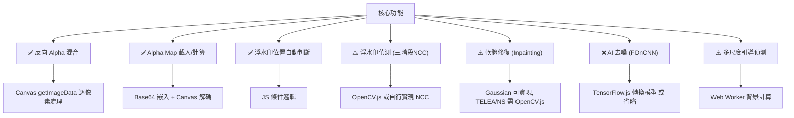

# GeminiWatermarkTool 前端網頁化可行性分析

> **原始專案**: [allenk/GeminiWatermarkTool](https://github.com/allenk/GeminiWatermarkTool)  
> **授權**: MIT License  
> **原作者**: Allen Kuo (@allenk)  
> **分析日期**: 2026-05-09  

---

## 一、原始專案概述

### 1.1 專案功能

GeminiWatermarkTool 是一個用於移除 Google Gemini / VEO / Nano Banana Pro 可見浮水印的工具，核心特色：

| 功能 | 說明 |
|------|------|
| **反向 Alpha 混合 (Reverse Alpha Blending)** | 數學精確還原原始像素 |
| **三階段浮水印偵測 (NCC)** | 空間相關、梯度邊緣、變異分析 |
| **AI 去噪 (FDnCNN)** | GPU 加速殘影清除 |
| **軟體修復 (Inpainting)** | Gaussian / TELEA / NS 方法 |
| **多尺度引導偵測 (Snap Engine)** | 粗到細 NCC 模板匹配 |
| **批次處理** | 整個目錄自動處理 |
| **GUI + CLI** | 桌面圖形介面 + 命令列 |

### 1.2 技術棧

| 層面 | 技術 |
|------|------|
| **語言** | C++ 20 (95.3%) |
| **影像處理** | OpenCV |
| **AI 推論** | NCNN + Vulkan GPU |
| **GUI** | ImGui + SDL3 + OpenGL/D3D11 |
| **建構** | CMake + vcpkg |
| **格式** | JPEG, PNG, WebP, BMP |

### 1.3 核心架構

```
src/
├── core/                    # 核心引擎 (CLI + GUI 共用)
│   ├── watermark_engine     # 主引擎：偵測 + 移除 + 添加
│   ├── blend_modes          # Alpha 混合/反混合演算法
│   ├── watermark_detector   # 浮水印偵測 (Legacy 介面)
│   ├── ai_denoise           # FDnCNN 神經網路去噪
│   └── types                # 型別定義
├── cli/                     # CLI 應用
├── gui/                     # 桌面 GUI (ImGui + SDL3)
└── assets/
    └── embedded_assets.hpp  # 內嵌 Alpha Mask (PNG 二進位)
```

---

## 二、核心演算法分析

### 2.1 反向 Alpha 混合 (可完全移植到 JS) ✅

Gemini 添加浮水印的公式：

```
watermarked = α × logo + (1 - α) × original
```

反向求解原始像素：

```
original = (watermarked - α × logo) / (1 - α)
```

**JavaScript 移植可行性：完全可行**

原始 C++ 實作逐像素迭代，邏輯清晰：

```cpp
for (int row = 0; row < image_f.rows; ++row) {
    for (int col = 0; col < image_f.cols; ++col) {
        float alpha = alpha_ptr[col];
        if (alpha < 0.002f) continue;       // 跳過無影響像素
        alpha = std::min(alpha, 0.99f);     // 避免除零
        float one_minus_alpha = 1.0f - alpha;
        for (int c = 0; c < 3; ++c) {
            float original = (watermarked - alpha * 255.0f) / one_minus_alpha;
            img_ptr[col][c] = std::clamp(original, 0.0f, 255.0f);
        }
    }
}
```

**→ 可直接用 Canvas API `getImageData()` / `putImageData()` 實現，逐像素操作。**

### 2.2 Alpha Map 計算 (可完全移植) ✅

Alpha Map 從內嵌的背景截圖 (48×48 和 96×96 PNG) 計算：

```
alpha = max(R, G, B) / 255
```

**→ 內嵌 PNG 資料 (bg_48_png: 1,677 bytes, bg_96_png: 8,165 bytes) 可轉為 Base64 直接嵌入 JS。**

### 2.3 浮水印位置規則 (可完全移植) ✅

```
如果 W > 1024 且 H > 1024:
    96×96 logo，邊距 64px（右下角）
否則:
    48×48 logo，邊距 32px（右下角）
```

**→ 簡單的條件邏輯，直接移植。**

### 2.4 三階段浮水印偵測 (部分可移植) ⚠️

| 階段 | 方法 | JS 可行性 |
|------|------|-----------|
| Stage 1: 空間 NCC | `cv::matchTemplate (TM_CCOEFF_NORMED)` | ⚠️ 需自行實現 NCC 或用 OpenCV.js |
| Stage 2: 梯度 NCC | `cv::Sobel` + `cv::magnitude` + NCC | ⚠️ 需 Sobel 濾波器實現 |
| Stage 3: 變異分析 | `cv::meanStdDev` 比較 | ✅ 可用 JS 計算均值/標準差 |

**置信度融合**：
```
confidence = spatial × 0.50 + gradient × 0.30 + variance × 0.20
```

**→ 可移植但需要較多工作量。可選方案：使用 OpenCV.js (~8MB) 或簡化為僅檢測固定位置。**

### 2.5 多尺度引導偵測 / Snap Engine (可選移植) ⚠️

- 粗搜尋：4px 步長遍歷尺寸範圍
- 細搜尋：2px 步長在最佳候選附近精修
- 尺寸偏好因子：`cbrt(scale / 96)`

**→ 計算量較大，但在前端可使用 Web Worker 避免阻塞 UI。**

### 2.6 軟體修復 Inpainting (部分可移植) ⚠️

| 方法 | JS 可行性 |
|------|-----------|
| **Gaussian Blur** | ✅ Canvas 可實現，或用 CSS filter |
| **TELEA** | ⚠️ 需自行實現 Fast Marching Method |
| **NS (Navier-Stokes)** | ⚠️ 需自行實現流體方程式 |

**→ Gaussian 方法最容易移植，TELEA/NS 需要 OpenCV.js 或自行實現。**

### 2.7 AI 去噪 FDnCNN (無法直接移植) ❌

- 需要 NCNN 推論引擎 + Vulkan GPU
- FDnCNN 模型 ~1.3MB (嵌入式權重)
- 20 層 Conv + ReLU 網路

**替代方案**：

| 方案 | 可行性 | 說明 |
|------|--------|------|
| **TensorFlow.js / ONNX.js** | ⚠️ 可行但需轉換模型 | 需要將 FDnCNN 轉換為 ONNX/TFLite 格式 |
| **WebGL shader** | ⚠️ 理論可行但開發量大 | 手動實現卷積推論 |
| **省略 AI 去噪** | ✅ 最簡方案 | 僅用 Gaussian/軟體修復替代 |
| **伺服器端推論** | ✅ 但需後端 | 上傳圖片到伺服器處理 |

---

## 三、前端移植可行性總結

### 3.1 功能分級



### 3.2 移植方案比較

| 方案 | 功能完整度 | 開發難度 | 檔案大小 | 離線可用 |
|------|-----------|---------|---------|---------|
| **A. 純 HTML/CSS/JS** | ⭐⭐⭐ (70%) | ⭐⭐ 中等 | ~50KB | ✅ 是 |
| **B. JS + OpenCV.js** | ⭐⭐⭐⭐ (85%) | ⭐⭐⭐ 較高 | ~8MB | ✅ 是 |
| **C. JS + OpenCV.js + TF.js** | ⭐⭐⭐⭐⭐ (95%) | ⭐⭐⭐⭐ 高 | ~15MB | ✅ 是 |
| **D. 前端 + 後端 API** | ⭐⭐⭐⭐⭐ (100%) | ⭐⭐⭐⭐ 高 | 前端小 | ❌ 否 |

### 3.3 推薦方案：方案 A — 純前端 (HTML + CSS + JS)

> [!IMPORTANT]
> **推薦理由**：核心功能（反向 Alpha 混合）是數學確定性演算法，不依賴任何 AI 模型或複雜圖像處理庫。原專案作者也強調此方法的精確性優於生成式修復。

**方案 A 可實現的功能**：

| 功能 | 實現方式 |
|------|---------|
| ✅ 圖片載入/預覽 | File API + Canvas |
| ✅ 反向 Alpha 混合移除浮水印 | Canvas `getImageData` 逐像素處理 |
| ✅ Alpha Map 自動載入 | Base64 嵌入 48×48 / 96×96 PNG |
| ✅ 自動判斷浮水印大小 | 圖片尺寸 > 1024 判斷 |
| ✅ 圖片匯出 (PNG/JPEG) | Canvas `toBlob` / `toDataURL` |
| ✅ 拖放上傳 | Drag & Drop API |
| ✅ 批次處理 | JS 迴圈 + Promise |
| ✅ 即時前後對比 | 雙 Canvas 疊加 |
| ⚠️ 基礎浮水印偵測 | 簡化版：固定位置 + 亮度分析 |
| ⚠️ Gaussian 軟修復 | JS 實現高斯模糊 + 梯度遮罩 |
| ❌ NCC 模板匹配 | 需自行實現或引入庫 |
| ❌ AI 去噪 | 省略或未來擴展 |

---

## 四、前端網頁規格書 (Spec)

### 4.1 產品定位

**Gemini Watermark Remover Web** — 純前端、零依賴的 Gemini 浮水印移除工具。所有處理在瀏覽器本地完成，圖片不會上傳到任何伺服器。

### 4.2 功能需求

#### P0 — 核心功能 (MVP)

| ID | 功能 | 說明 |
|----|------|------|
| F-01 | 圖片上傳 | 支援拖放 + 點擊上傳，格式：JPG/PNG/WebP/BMP |
| F-02 | 自動浮水印移除 | 反向 Alpha 混合演算法，自動判斷 48×48 或 96×96 |
| F-03 | 即時預覽 | 處理前後對比（滑桿或切換） |
| F-04 | 圖片下載 | 輸出 PNG（無損）或 JPEG（品質可調） |
| F-05 | 內嵌 Alpha Mask | 48×48 + 96×96 PNG 以 Base64 嵌入 |

#### P1 — 增強功能

| ID | 功能 | 說明 |
|----|------|------|
| F-06 | 批次處理 | 多張圖片一次處理，進度追蹤 |
| F-07 | 手動區域選擇 | 框選浮水印位置（自訂模式） |
| F-08 | Gaussian 殘影修復 | 梯度遮罩 + 高斯模糊，strength 可調 |
| F-09 | 基礎偵測 | 簡化版浮水印存在性檢查（亮度分析） |
| F-10 | 縮放/平移 | 圖片檢視器功能 |

#### P2 — 進階功能（未來擴展）

| ID | 功能 | 說明 |
|----|------|------|
| F-11 | OpenCV.js 整合 | 完整 NCC 偵測 + TELEA/NS 修復 |
| F-12 | Web Worker | 大圖處理時避免 UI 阻塞 |
| F-13 | PWA 支援 | Service Worker 離線可用 |
| F-14 | 自訂 Alpha Map | 上傳自訂遮罩 |

### 4.3 技術架構

```
浮水印去除器/
├── index.html              # 主頁面
├── css/
│   └── style.css           # 樣式（暗色主題、glassmorphism）
├── js/
│   ├── app.js              # 主應用邏輯 & UI 控制
│   ├── watermark-engine.js # 核心引擎（反向 Alpha 混合）
│   ├── alpha-masks.js      # 內嵌 Alpha Mask 資料
│   ├── image-loader.js     # 圖片載入/匯出
│   └── ui-components.js    # UI 元件（滑桿對比、拖放等）
└── assets/
    └── (透過 JS 內嵌，無需外部檔案)
```

### 4.4 核心演算法 JS 虛擬碼

```javascript
// watermark-engine.js

class WatermarkEngine {
    constructor() {
        this.alphaMap48 = null; // 48×48 Float32Array
        this.alphaMap96 = null; // 96×96 Float32Array
        this.logoValue = 255.0;
    }

    async init() {
        // 從 Base64 解碼內嵌 PNG → Canvas → 計算 Alpha Map
        this.alphaMap48 = await this.loadAlphaMap(ALPHA_48_BASE64, 48, 48);
        this.alphaMap96 = await this.loadAlphaMap(ALPHA_96_BASE64, 96, 96);
    }

    loadAlphaMap(base64, w, h) {
        // 1. Base64 → Image → Canvas
        // 2. getImageData → 取 RGBA 像素
        // 3. alpha[i] = max(R, G, B) / 255.0
        // 4. 返回 Float32Array
    }

    getWatermarkConfig(imageW, imageH) {
        if (imageW > 1024 && imageH > 1024) {
            return { size: 96, margin: 64, alphaMap: this.alphaMap96 };
        }
        return { size: 48, margin: 32, alphaMap: this.alphaMap48 };
    }

    removeWatermark(imageData, width, height) {
        const config = this.getWatermarkConfig(width, height);
        const { size, margin, alphaMap } = config;

        // 浮水印位置（右下角）
        const posX = width - margin - size;
        const posY = height - margin - size;

        const pixels = imageData.data; // Uint8ClampedArray [R,G,B,A, ...]

        for (let row = 0; row < size; row++) {
            for (let col = 0; col < size; col++) {
                const alpha = alphaMap[row * size + col];
                if (alpha < 0.002) continue;

                const a = Math.min(alpha, 0.99);
                const oneMinusA = 1.0 - a;

                const px = posX + col;
                const py = posY + row;
                if (px < 0 || px >= width || py < 0 || py >= height) continue;

                const idx = (py * width + px) * 4;

                for (let c = 0; c < 3; c++) {
                    const watermarked = pixels[idx + c];
                    const original = (watermarked - a * this.logoValue) / oneMinusA;
                    pixels[idx + c] = Math.max(0, Math.min(255, Math.round(original)));
                }
            }
        }
        return imageData;
    }
}
```

### 4.5 UI 設計需求

| 元素 | 說明 |
|------|------|
| 主題 | 暗色主題 (Dark Mode)，與原工具風格一致 |
| 風格 | Glassmorphism + 微動畫，現代感 |
| 佈局 | 單頁應用，上方工具列 + 中央預覽區 + 底部控制 |
| 拖放區 | 大面積拖放區域，虛線邊框動畫 |
| 對比功能 | 滑桿式前後對比（Before/After slider） |
| 響應式 | 支援手機/平板/桌面 |
| 無障礙 | 適當的 ARIA 標記 |

### 4.6 效能考量

| 項目 | 策略 |
|------|------|
| 大圖處理 | 處理區域僅限浮水印 ROI (48×48 或 96×96)，不需處理整張圖 |
| 記憶體 | Canvas 直接操作像素，避免不必要的複製 |
| 速度預估 | 96×96 = 9,216 像素 × 3 通道 = ~27,648 次運算，瞬時完成 |
| 批次處理 | 使用 `requestAnimationFrame` 分批處理避免 UI 凍結 |
| Web Worker | P2 功能，用於多尺度偵測等計算密集任務 |

### 4.7 瀏覽器相容性

| 瀏覽器 | 最低版本 | 關鍵 API |
|--------|---------|---------|
| Chrome | 69+ | Canvas 2D, File API, Drag & Drop |
| Firefox | 65+ | 同上 |
| Safari | 12+ | 同上 |
| Edge | 79+ | 同上 (Chromium) |

### 4.8 法律與授權

> [!WARNING]
> 原專案採用 **MIT License**。若使用其程式碼或遮罩資產（Alpha Mask），**必須**：
> 1. 保留原始版權聲明
> 2. 包含完整 MIT 授權文字
> 3. （建議）附上原始 repo 連結歸屬

---

## 五、風險與限制

### 5.1 功能限制

| 限制 | 影響 | 緩解方案 |
|------|------|---------|
| 無 AI 去噪 | 經過後製的圖片殘影較明顯 | Gaussian 軟修復可部分替代 |
| 簡化偵測 | 無法精確偵測非標準位置浮水印 | 提供手動選擇模式 |
| 無影片處理 | 不支援 VEO 影片浮水印 | 超出前端能力範圍 |
| SynthID | 無法移除隱形浮水印 | 技術上不可能，非本工具目標 |

### 5.2 技術風險

| 風險 | 嚴重度 | 說明 |
|------|--------|------|
| Alpha Mask 精確度 | 低 | 原始 PNG 資料可直接提取，數學確定性 |
| 瀏覽器 Canvas 限制 | 低 | 主流瀏覽器均完整支援 |
| 大圖記憶體 | 中 | 超大圖片 (>50MP) 可能導致記憶體不足 |
| WebP 支援 | 低 | 現代瀏覽器原生支援 |

---

## 六、結論

> [!TIP]
> **結論：完全可行**。GeminiWatermarkTool 的核心演算法（反向 Alpha 混合）是純數學運算，完全可以用 HTML + CSS + JavaScript 在瀏覽器端實現。

### 關鍵優勢

1. **核心演算法簡單明確** — 逐像素的數學公式，不依賴任何外部庫
2. **處理區域極小** — 僅需處理 48×48 或 96×96 像素區域，效能無問題
3. **Alpha Mask 可嵌入** — 兩個 PNG 合計 ~10KB，直接 Base64 內嵌
4. **零伺服器依賴** — 所有處理在瀏覽器本地完成，隱私安全
5. **無需安裝** — 開啟網頁即可使用，降低使用門檻

### 建議開發順序

```
Phase 1 (MVP)     → F-01~F-05：基礎上傳、移除、預覽、下載
Phase 2 (增強)    → F-06~F-10：批次、手動選擇、Gaussian 修復
Phase 3 (進階)    → F-11~F-14：OpenCV.js、Web Worker、PWA
```

**預估開發時間**：Phase 1 約 1-2 天即可完成。
